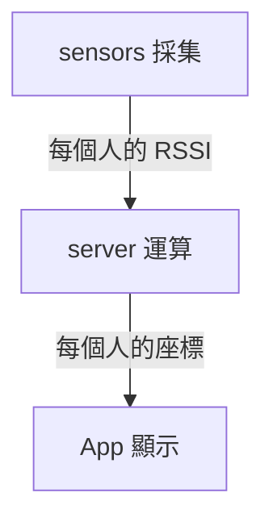

## 一、專案概述

本專案為 indoor-positioning-bilateration 系統的「感測器 (Sensor)」部分，負責在教室環境中接收手機 BLE 廣播訊號，計算 RSSI，並透過 MQTT 將數據傳送至伺服器端進行三邊定位。

### 二、系統架構

```mermaid
flowchart
A[sensors 採集]-- 每個人的 RSSI -->B[server 運算] -- 每個人的座標 -->C[App 顯示]
```

### 三、文檔

1. [[1 感測器]]
2. server
3. app