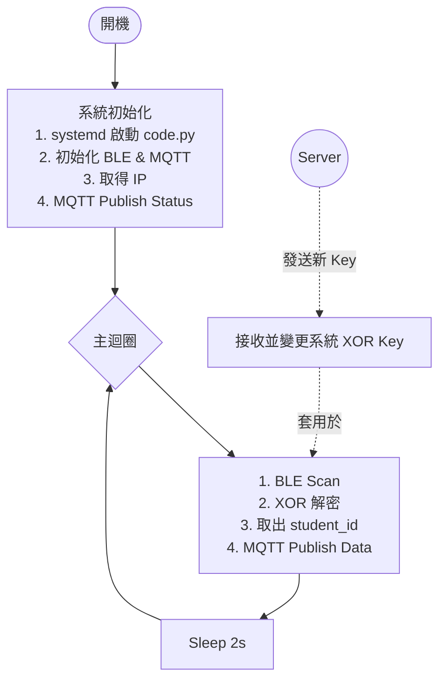

### 程式一 — `beacons/code.py`

常駐背景的 BLE 掃描程式，透過 **systemd** 開機自啟。

### 功能摘要

| 功能          | 說明                                                        |
| ----------- | --------------------------------------------------------- |
| **開機回報 IP** | 啟動時發送 `{topic}/status/{RECEIVER_NO}`，內容含本機 IP，方便 SSH      |
| XOR Key 取得  | 開始點名時，伺服器發布 XOR Key                                       |
| **BLE 掃描**  | 每秒掃描一次，過濾 `uuid=1111` 的廣告封包                               |
| **封包解密**    | 提取 Service Data → XOR 解密 → 取出學號 (`student_id`) 用來區分不同人的位置 |
| **MQTT 推送** | 將結果以 JSON 格式發送至 `{topic}/receivers/{RECEIVER_NO}`         |

### 行為流程


### MQTT 訊息格式

Base topic 統一為 **`mcu/indoor-location`**（所有檔案共同使用的命名空間）。

| 用途                  | Topic                                         | 方向                       |
| ------------------- | --------------------------------------------- | ------------------------ |
| RSSI 定位資料           | `mcu/indoor-location/receivers/{RECEIVER_NO}` | RasPi → Server           |
| 開機狀態 / IP           | `mcu/indoor-location/status/{RECEIVER_NO}`    | RasPi → Server           |
| **Session XOR Key** | `mcu/indoor-location/session_key`             | Server → RasPi（retained） |

### 1. 輸入

**1.1 Session XOR Key**
[[2.2.1 定位計算程式 — 跨程式介面規格]] -> Broker -> 感測器
`mcu/indoor-location/session_key`
能確保每個階段都能使用正確的 XOR Key 解密出學號 

```json
{
	"XOR_key": ""
}
```
### 2. 輸出

**2.1. 開機狀態回報**
感測器 -> Broker
Topic:` mcu/indoor-location/status/{RECEIVER_NO}`

```json
{
    "receiver_no": 1,
    "ip": "192.168.1.100",
    "status": "online"
}
```

**2.2 RSSI 資料推送**
感測器 -> Broker -> [[2.2.1 定位計算程式 — 跨程式介面規格]]
Topic: `mcu/indoor-location/receivers/{RECEIVER_NO}`

```json
{
    "student_id": "11012345",
    "OTP": "ABCDE",
    "mac": "B4E7B36041B4",
    "rssi": -72,
    "scanner_id": 1,
    "time": "dd/mm/yyyy HH:MM:SS"
}
```

| 欄位 | 型態 | 說明 |
|------|------|------|
| `student_id` | string | 8 位學號（從 XOR 解密封包取得）★ **唯一識別** |
| `mac` | string | 手機 BLE MAC 位址（大寫無分隔）。**僅供除錯，不可作為識別**（MAC 會隨機化變動） |
| `rssi` | int | 原始 RSSI 值（不做濾波，留給伺服器端處理） |
| `scanner_id` | int | 樹莓派自身的編號（`RECEIVER_NO`） |
| `time` | string | NTP 同步後的時間戳 |
