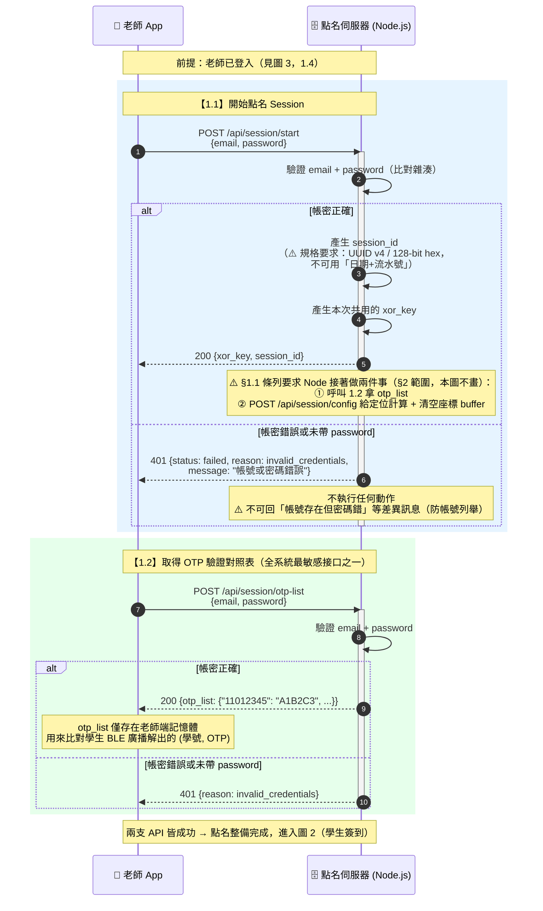
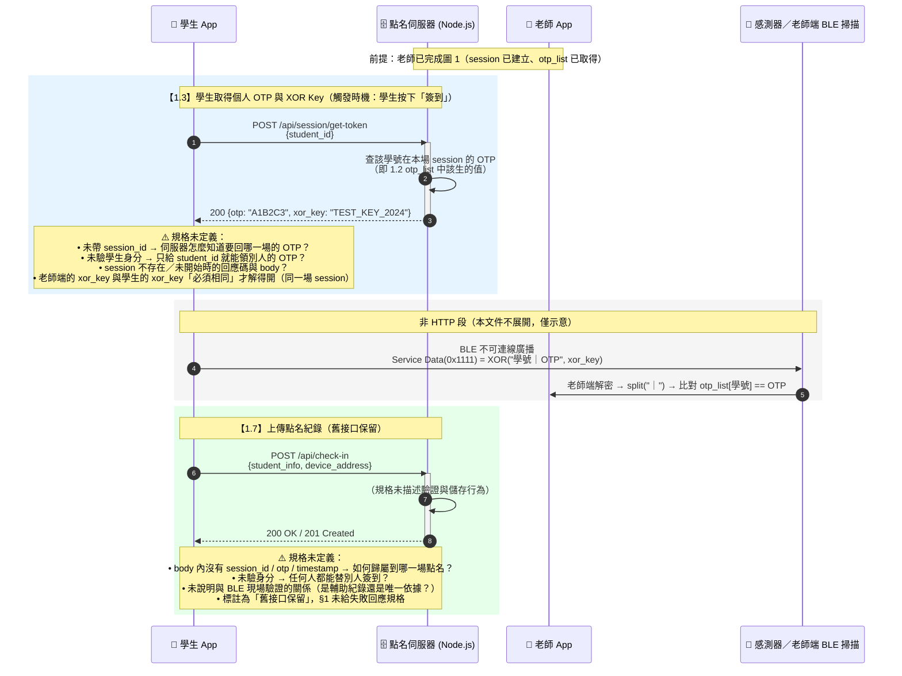
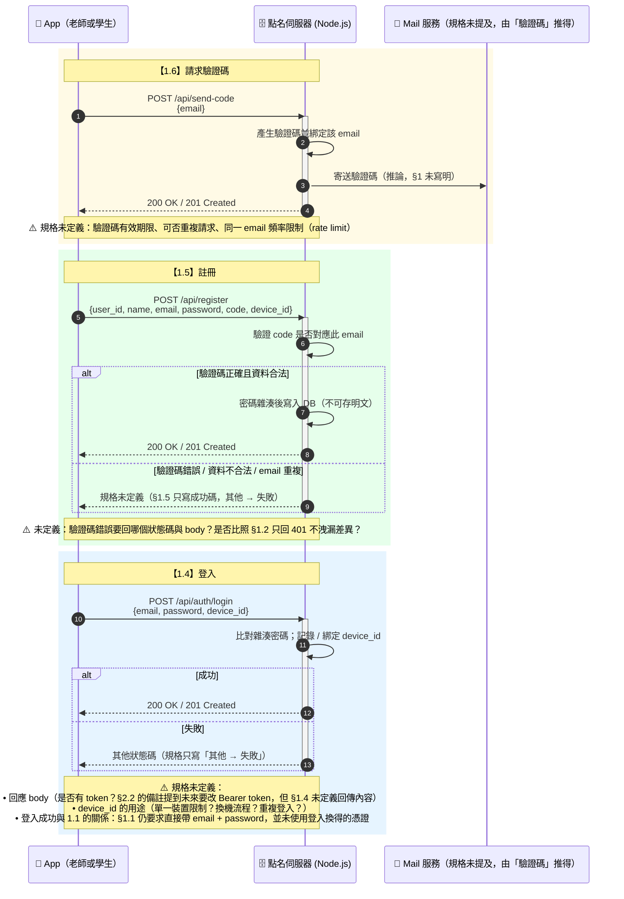
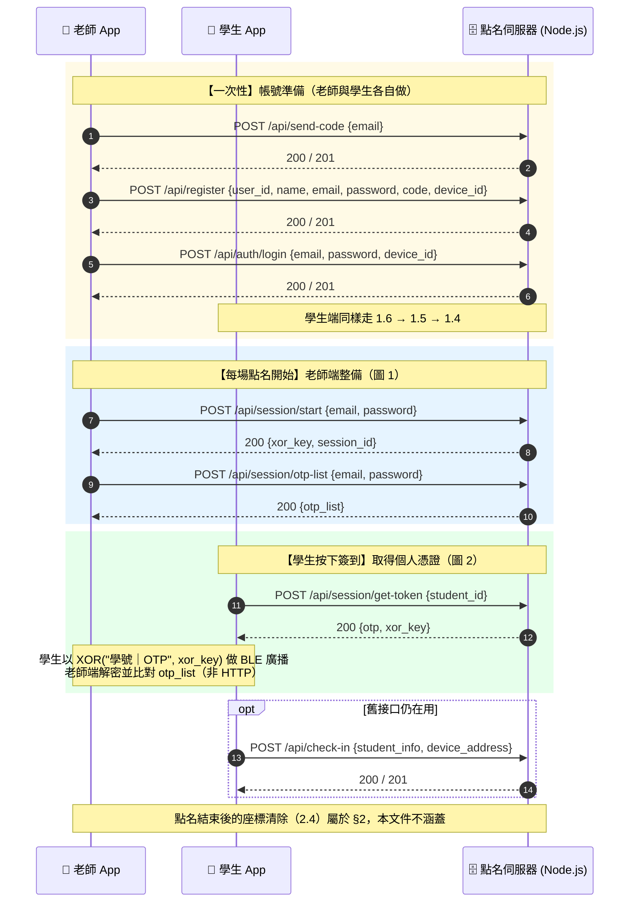

# Node.js 主程式 API — 時序圖（不含定位）

> **依據文件：** [[2.3 Node.js 主程式 API]] §1（後端 API 規格）
> **範圍：** 只涵蓋 §1 的 7 支 API（`/api/session/start`、`/api/session/otp-list`、`/api/session/get-token`、`/api/auth/login`、`/api/register`、`/api/send-code`、`/api/check-in`）。
> **不在範圍：** §2 所有與定位有關的 API（`/api/coords`、`/api/coords/get`、`/api/coords/clear`）與 §2.2.1 的 `/api/session/config`、MQTT 全部不畫。
> 因此本文件的圖**不含**定位計算程式、感測器、MQTT Broker。

> ⚠️ **本文件只根據 §1 規格文字推導，未參考 App 或 Node 原始碼。**
> 凡規格沒寫到的地方（例如 1.1 成功後 Node 要不要同步回傳 `otp_list`、1.3 對已結束 session 的行為、`/api/check-in` 是否要驗身分）一律以 **「⚠️ 規格未定義」** 標記，不算結論。

---

## 0. 參與者與角色

| 參與者 | 說明 | 通訊方式 |
|--------|------|----------|
| 📱 老師 App | 發起點名、拿 OTP 對照表 | HTTPS → Node |
| 📱 學生 App | 取得個人 OTP / XOR Key、BLE 廣播簽到、上傳點名紀錄 | HTTPS → Node |
| 🗄️ Node（點名伺服器） | 唯一的後端；本文件所有 API 的提供者 | 對外只走 HTTPS |
| 📡 感測器（樹莓派） | 只出現在「學生 BLE 廣播被誰聽到」的物理鏈路示意，**不與 Node 直接通訊** | BLE 廣播（單向） |

**共同前提（§1 基礎資訊）：**

| 項目 | 值 |
|------|-----|
| Base URL | `https://micronemous-indefeasibly-cooper.ngrok-free.dev` |
| Content-Type | `application/json; charset=UTF-8` |
| Timeout | 5 秒 |

> 🔑 **老師專用 request 必帶 `password`**：§1.1、§1.2、§2.2、§2.4 皆是。
> 缺漏或驗證失敗 → 一律 `401 Unauthorized`，**不得執行任何動作**。
> 帳密在規格上是明文欄位，實際靠 HTTPS 保護，伺服器端比對雜湊值。

---

## 1. §1 API 一覽（本文件要畫的全部）

| 編號 | Method | Path | 發起方 | 用途 | 需要老師帳密 |
|------|--------|------|--------|------|:---:|
| 1.1 | `POST` | `/api/session/start` | 老師 App → Node | 開始點名，取得 `xor_key` + `session_id` | ✅ |
| 1.2 | `POST` | `/api/session/otp-list` | 老師 App → Node | 取得全班「學號 → OTP」對照表 | ✅ |
| 1.3 | `POST` | `/api/session/get-token` | 學生 App → Node | 學生取得**個人** `otp` + `xor_key` | ❌（規格未要求） |
| 1.4 | `POST` | `/api/auth/login` | App → Node | 登入 | ❌（帳密在 body） |
| 1.5 | `POST` | `/api/register` | App → Node | 註冊（帶驗證碼 + `device_id`） | ❌ |
| 1.6 | `POST` | `/api/send-code` | App → Node | 請求 Email 驗證碼 | ❌ |
| 1.7 | `POST` | `/api/check-in` | App → Node | 上傳點名紀錄（**舊接口保留**） | ❌（規格未定義） |

**成功碼慣例：** 1.1、1.2 為 `200 OK`（有回傳內容），1.4～1.7 為 `200 OK / 201 Created`（規格僅寫「成功」，未指定回傳 body）。

---

## 2. 圖 1：老師開始點名（1.1 + 1.2，前置整備）

一次點名開始時，老師端要**連續打兩支**老師專用 API：先拿 `xor_key` + `session_id`，再拿 `otp_list`。

**為什麼要兩支而不是一支？**
規格把「本次金鑰」與「全班 OTP 對照表」拆開，兩者敏感度不同：`xor_key` 只是解密參數，`otp_list` 拿到就能**偽造任意學生簽到**，所以 1.2 被單獨標示為最敏感接口，必須獨立驗身分。

> ⚠️ **規格未定義：** 1.1 回傳的 `session_id` 與 1.2 取得 `otp_list` 之間**沒有帶 `session_id`**。
> 從 §1.2 的 Request Body 只有 `email` + `password` 來看，1.2 回的是「這位老師班級的當下 OTP 表」，
> 不是「指定 session 的 OTP 表」。若同一老師同時開兩場點名，**規格上無從區分**。

---

## 3. 圖 2：學生簽到（1.3 取 OTP → BLE 廣播 → 1.7 上傳紀錄）

學生端流程在 §1 裡只有兩支 API：**1.3 取個人 `otp` + `xor_key`**、**1.7 上傳點名紀錄**。
中間的「BLE 廣播 → 老師端解密比對」不是 HTTP，屬於 §1 之外的實體鏈路，本圖僅以虛線／註記示意，**不展開**。

**觀察：1.7 是一支「沒有驗證、沒有 session 綁定、只有成功碼」的接口。**
在整份 §1 裡它是最寬鬆的一支，與 1.1／1.2 的嚴格驗證形成強烈對比。若它仍會被 App 呼叫，等於繞過了 1.2 的 OTP 對照表防線。

---

## 4. 圖 3：帳號生命週期（1.6 請求驗證碼 → 1.5 註冊 → 1.4 登入）

這三支是老師與學生**共用**的帳號 API，與點名 session 無關，因此獨立成一張圖。

**貫穿三支的共同欄位 `device_id`：** 只有 1.4 與 1.5 帶它，1.1～1.3、1.7 都不帶。
推論是「裝置綁定」用途，但 §1 完全沒寫規則。

---

## 5. 圖 4：§1 全景（不含定位的完整串接）

把圖 1～圖 3 接起來，一次看完「新使用者註冊 → 登入 → 老師開點名 → 學生簽到」的完整時序。

---

## 6. §1 錯誤回應對照

| 編號 | API | 成功 | 失敗回應（§1 有明確定義的才列） |
|------|-----|------|--------------------------------|
| 1.1 | `/api/session/start` | `200` `{xor_key, session_id}` | `401` `{status:"failed", reason:"invalid_credentials", message:"帳號或密碼錯誤"}` |
| 1.2 | `/api/session/otp-list` | `200` `{otp_list}` | `401` `{status:"failed", reason:"invalid_credentials", ...}` |
| 1.3 | `/api/session/get-token` | `200` `{otp, xor_key}` | ⚠️ §1 未定義 |
| 1.4 | `/api/auth/login` | `200` / `201` | 「其他 → 失敗」，未定義狀態碼與 body |
| 1.5 | `/api/register` | `200` / `201` | ⚠️ §1 未定義 |
| 1.6 | `/api/send-code` | `200` / `201` | ⚠️ §1 未定義 |
| 1.7 | `/api/check-in` | `200` / `201` | ⚠️ §1 未定義 |

**§1 的驗證失敗通則：**

> ⚠️ 驗證失敗時**只回 401**，不可回「帳號存在但密碼錯」之類的差異訊息（避免帳號列舉）。

---

## 7. 從 §1 規格可直接看出的安全落差

以下都是**只讀 §1 文字**就能判斷的，不需要看原始碼：

| # | 落差 | 依據 |
|---|------|------|
| 1 | **1.3 完全沒有身分驗證**，只給 `student_id` 就回該生的 `otp` + 全班共用的 `xor_key` | §1.3 Request Body 僅 `{student_id}`；且 `xor_key` 是「本次 Session 所有學生共用」 |
| 2 | **1.3 沒有帶 `session_id`**，卻要回「本次 session 的 OTP」 | §1.3 無 `session_id` 欄位，但回應含 session 級別的 `xor_key` |
| 3 | **`xor_key` 是全班共用**，一旦由 1.3 洩漏，等於全班廣播可被解密 | §1.1 註解「本次 Session 所有學生共用的 XOR 加密金鑰」 |
| 4 | **1.7 沒有驗身分、沒有 session 綁定、body 無 OTP** | §1.7 Request Body 僅 `student_info` + `device_address` |
| 5 | **1.4 登入後沒有任何憑證被後續 API 使用**，1.1／1.2 仍要求每次帶明碼 `password` | §1.1／§1.2 Request Body；§2.2 備註也自承「每次請求都帶明碼密碼不是長久之計」 |
| 6 | **1.1／1.2 沒有 rate limit 的規格描述** | §1 未提及；§2.6 第 7 項才把 rate limit 列為待辦 |

> 第 1～4 項合起來即是：**知道一個學號就能取得該生 OTP 與全班金鑰**，而 OTP 正是老師端判定簽到成功的唯一依據。
> 這與 §1.2 對 `otp_list` 的嚴格保護（必須驗老師帳密、401 不得洩漏差異）形成明顯矛盾。

---

## 8. 規格未定義 / 需要補的點（依 API 分）

| API | 未定義項目 |
|-----|-----------|
| 1.1 | 同一老師重複呼叫是否作廢舊 session？舊 session 的 `xor_key` 是否失效？回應是否也該回 `otp_list`（§1.1 註解要求 Node「接著」呼叫 1.2，但卻由 App 自己再打一次）？ |
| 1.2 | 沒帶 `session_id`，怎麼對應到 1.1 剛建立的那場？ |
| 1.3 | 未驗身分、未帶 `session_id`、session 不存在時的回應；OTP 是否會過期 |
| 1.4 | 回應 body（是否發 token）、`device_id` 規則、失敗狀態碼 |
| 1.5 | 驗證碼錯誤的回應、`user_id` 與 `email` 的關係（是否強制 `user_id@me.mcu.edu.tw`） |
| 1.6 | 驗證碼時效、重送頻率限制 |
| 1.7 | 是否仍需驗身分、是否綁 session、與 BLE 驗證的關係 |
| 全部 | 沒有任何 API 定義「結束點名」；老師按下結束對應的是 §2.4 `/api/coords/clear`（只清座標，不等於結束 session） |

---

## 9. 與其他文件的關係

| 文件 | 負責範圍 |
|------|----------|
| [[2.3 Node.js 主程式 API]] §1 | App ↔ Node 的點名流程（session / OTP / 登入註冊） |
| **本文件** | §1 這 7 支 API 的**時序圖**（不含定位） |
| [[2.3 Node.js 主程式 API]] §2 與 [[2.2.1 定位計算程式 — 跨程式介面規格]] | 座標收／存／發／清 + Node ↔ 定位計算 + MQTT（**不在本文件範圍**） |
| `diagrams.md` | 含定位的跨程式時序圖（圖 0～圖 3） |
| [[APP端如何處理封包]] | 學生端 BLE 廣播封包的位元層細節 |
