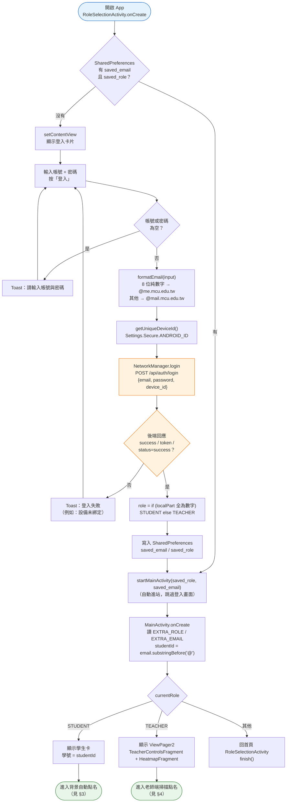
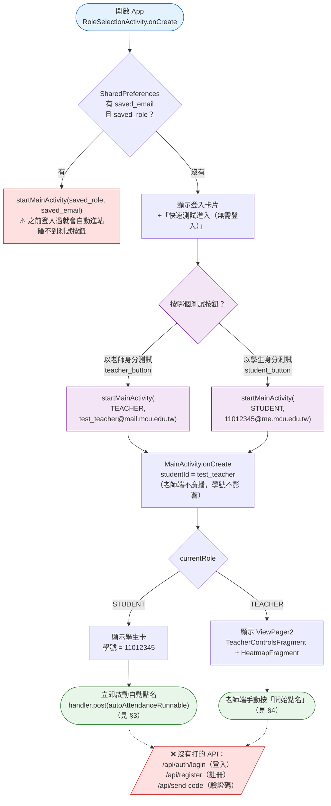
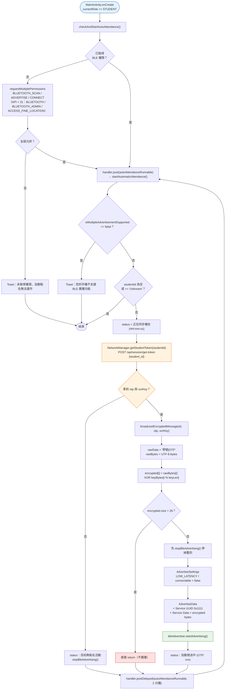
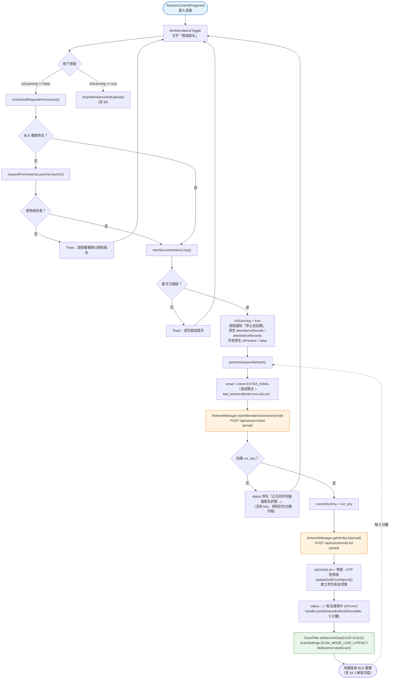
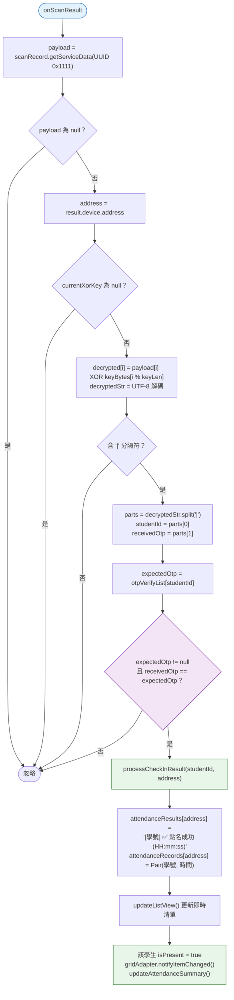
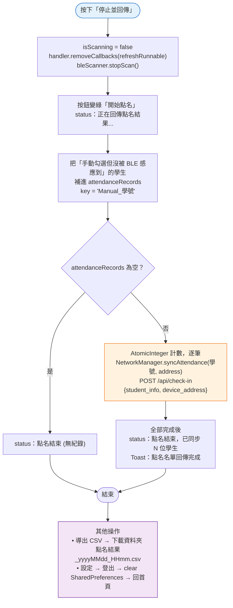
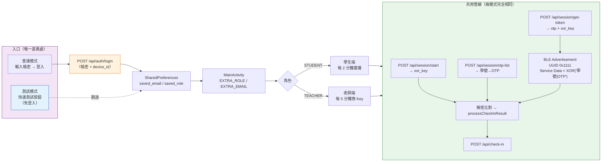

# 3.1.1 測試模式

> 來源檔：
> - `app/app/src/main/java/com/mcu/bluetooth/RoleSelectionActivity.kt`（登入 / 角色分流）
> - `app/app/src/main/java/com/mcu/bluetooth/MainActivity.kt`（學生端廣播、老師端容器）
> - `app/app/src/main/java/com/mcu/bluetooth/TeacherControlsFragment.kt`（老師端掃描 / 解密 / 回傳）
> - `app/app/src/main/java/com/mcu/bluetooth/NetworkManager.kt`（HTTP API）
>
> 對照：`APP端如何處理封包.md`（BLE 封包格式）、`3.1.2 我自己寫的測試模式.md`（測試帳號 OTP 對照表）

---

## 0. 兩者的差異只有「入口」

自動點名之後的流程（要 OTP / XOR Key → XOR 加密 → BLE 廣播 → 老師端解密比對 → 回傳伺服器）**兩種模式完全一樣**，程式碼是同一份，沒有任何 `if (測試模式)` 分支。

唯一差別在 **`RoleSelectionActivity` 怎麼把角色與 email 交給 `MainActivity`**：

| 項目 | 普通模式 | 測試模式 |
|------|---------|---------|
| 進入方式 | 輸入帳號密碼 → 按「登入」 | 按「**以老師／學生身分測試**」→ 免登入 |
| 有無打後端 | ✅ `POST /api/auth/login`（`email` + `password` + `device_id`） | ❌ 完全不打 API，直接跳頁 |
| 角色怎麼決定 | 由 email `@` 前是否全為數字推斷 | 由按鈕直接寫死 |
| 帶入的 EXTRA_EMAIL | 使用者輸入的真實帳號 | 老師 `test_teacher@mail.mcu.edu.tw` 學生 `11012345@me.mcu.edu.tw` |
| 推導出的學號 | 真實學號（`email.substringBefore("@")`） | 固定 `11012345` |
| 登入狀態 | 寫入 SharedPreferences（`saved_email`／`saved_role`），下次自動進站 | 不寫入，**每次都要重按** |
| 換場地 / 換人 | 需重新登入 | 只要改按鈕寫死的 email（或改用 3.1.2 的多組學號選擇） |
| 裝置綁定檢查 | ✅ 後端驗 `device_id` | ❌ 跳過（老師端可用模擬器） |

> 測試模式的 UI 位置：`activity_role_selection.xml` 的 `test_label`
> 「`--- 快速測試進入 (無需登入) ---`」底下兩個 `OutlinedButton`：
> `teacher_button`（以老師身分測試）、`student_button`（以學生身分測試）。

---

## 1. 普通模式（正式模式）流程圖

---

## 2. 測試模式流程圖

> ⚠️ **`B -- 有` 這條路是測試模式的陷阱**：只要普通模式登入過一次，
> SharedPreferences 就會一直被帶入，測試按鈕永遠看不到。
> 需要先按「設定 → 登出」（`logout()` 會 `sharedPref.edit().clear()`）才會回到登入頁。

---

## 3. 學生端自動點名（兩種模式共用）

**重點**

- 間隔 `AUTO_REFRESH_INTERVAL = 2 * 60 * 1000L`：學生端每 **2 分鐘**重新拿一次 token 並重新廣播。
  刻意比老師端的 5 分鐘短，確保老師換 Key 時學生能更快跟上。
- 手動按鈕「手動立即簽到」也是呼叫同一個 `startAutomaticAttendance()`。
- 權限被拒後**不會**再排程，必須重開 App。

---

## 4. 老師端掃描點名（兩種模式共用）

### 4.1 `scanCallback` 解密與驗證

**關鍵：Key 必須同一把**

學生端加密用的 `xorKey`（`/api/session/get-token` 拿到的）與老師端解密用的 `currentXorKey`
（`/api/session/start` 拿到的）**必須是同一場 session 的同一把 key**，否則解出來是亂碼，
`split("|")` 後的學號／OTP 都不會對，`otpVerifyList` 比對失敗 → 直接丟棄。

---

## 5. 結束點名與回傳

> ⚠️ **注意**：`syncAttendance` 的第二個參數是 BLE 的 `device.address`（MAC），
> 但手機 MAC 會隨機化（LE Random Address）而變動；
> 與 `indoor-locator/README.md`「身分識別 = `student_id`，不使用 BLE MAC」的設計不一致。

---

## 6. 兩模式並存的全域對照圖

---

## 7. 目前程式碼的實作狀態（誠實對照）

| 文件寫的 | 程式碼實際狀況 |
|---------|--------------|
| 測試模式用固定 `TEST_XOR_KEY = "TEST_KEY_2024"` | ❌ **App 尚未實作**。App 端沒有 `USE_TEST_MODE` / `TEST_KEY_2024` 常數，測試模式的學生端一樣打 `/api/session/get-token`。 |
| 免登入測試模式 | ✅ 已實作，但只做到「跳過登入」，**OTP 與 XOR Key 仍需要伺服器**（見 `TODO.md`）。 |
| 測試用固定 OTP 對照表 | ❌ 未在 App 內。固定學號 `11012345`，OTP 由後端給；`3.1.2 我自己寫的測試模式.md` 的 `A1B2C3`／`D4E5F6` 等是給模擬器（`mock_sensor.py --otp-list`）用的。 |
| 第一階段臨時伺服器免登入 | ✅ 但 `mock_server.py` 的 `new_xor_key()` 是**隨機產生**，不是寫死 `TEST_KEY_2024`（刻意與第二/三階段行為一致）。 |
| 老師端用模擬器 run | ⚠️ 需 `isMultipleAdvertisementSupported` 為 true 的裝置才能廣播；老師端只掃描所以模擬器可跑，但模擬器常回無 BLE 適配器。 |

### API 使用狀況

| 函式 | 端點 | 狀態 |
|------|------|------|
| `login` | `POST /api/auth/login` | 測試模式不使用 |
| `registerUser` | `POST /api/register` | 測試模式不使用 |
| `requestVerifyCode` | `POST /api/send-code` | 測試模式不使用 |
| `startAttendanceSession` | `POST /api/session/start` | ✅ 老師端每次刷新都打 |
| `getVerifyList` | `POST /api/session/otp-list` | ✅ 老師端每次刷新都打 |
| `getStudentToken` | `POST /api/session/get-token` | ✅ 學生端每 2 分鐘打 |
| `syncAttendance` | `POST /api/check-in` | ✅ 停止點名時逐筆打 |
| — | `POST /api/coords/get` | ❌ App 端還沒接（`HeatmapFragment` 目前跑 `simulateServerData()` 假資料） |
| — | `POST /api/coords/clear` | ❌ App 端還沒接 |

`NetworkManager.BASE_URL = "https://micronemous-indefeasibly-cooper.ngrok-free.dev"`（寫死在程式碼中）。

---

## 8. 測試模式操作前提（速記）

1. **先確定沒有殘留登入**：若 App 直接跳過登入頁，按「設定（齒輪）→ 登出」清掉 SharedPreferences。
2. **老師端**：按「以老師身分測試」→ `TeacherControlsFragment` → 按「開始點名」。
   後端必須已經有 `test_teacher@mail.mcu.edu.tw` 的 session（`mock_server.py` / Node 需接受這個 email）。
3. **學生端**：按「以學生身分測試」→ 自動以學號 `11012345` 開始每 2 分鐘廣播。
   老師端的 `otp_list` 必須含 `11012345`，否則解密後 `expectedOtp == null` → 丟棄。
4. **學生端必須實機**：需要 `isMultipleAdvertisementSupported == true`，模擬器通常不支援 BLE 廣播。
5. **兩端 Key 必須同場**：先讓老師端「開始點名」拿到 key 並啟動掃描，再讓學生端廣播。

