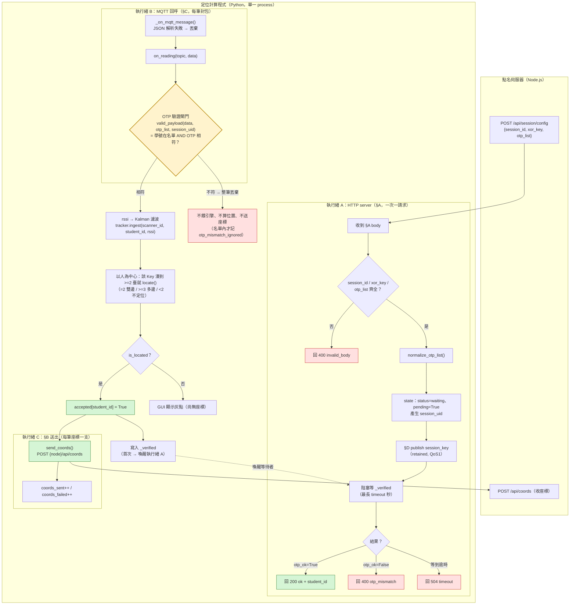
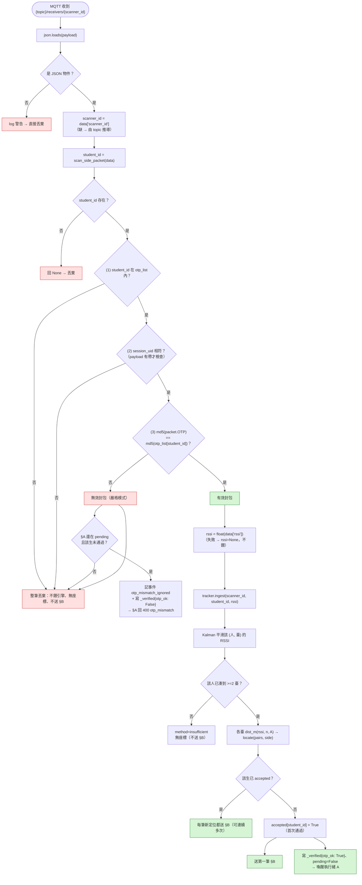

## 1. 全域坐標與單位（先定死，最優先）

| 規則 | 值 |
|------|-----|
| 內部座標單位 | **公尺(m)**，一律 float |
| 座標原點 | 教室角落 (0,0)，x 朝黑板寬向、y 朝座位深向（於 GUI 校正時約定） |
| 感測器位置 | `pos_m = (x_m, y_m)` |
| 網格(grid) | **僅顯示與輸出用**。`col=int(x_m/邊長)`, `row=int(y_m/邊長)` |
| 教室範圍 | `room_m: {width_m, height_m}`（畫底圖與交點越界檢查） |

> 全系統唯一座標真理 = 公尺。grid 與畫布都是它的 view。

---

## 2. 資料模型（核心資料結構）

### 2.1 ScannerConfig — 每臺感測器一組（重點：參數「每臺一份」）
```
scanner_id : int          # 對應 MQTT receivers/{scanner_id}
name       : str          # 例「黑板左角」
pos_m      : (float,float)# 公尺
n          : float        # path-loss exponent（每臺可不同）
A          : float        # 1 公尺處 ref RSSI dBm（每臺可不同，預設 A=-40,n=2.0）
```
> 舊 calc.py 是全域單一 n/A；新引擎要「每臺各一組(n,A)」，GUI 才能逐臺校。

### 2.2 Reading — 單筆 MQTT 資料
```
student_id, rssi(int), [mac], [scanner_id], [time]
```
> `mac` 僅供除錯，**不作為識別**：BLE MAC 會隨機化(LE Random Address)而變動，
> 同一支手機可能換 MAC。身分一律用 `student_id`。

### 2.3 引擎內部狀態（以「人」為中心，才能多裝置）
- Key = `student_id`（8 位學號）★ **不使用 mac**
- 值 = `Dict[scanner_id -> filtered_rssi]`（每臺最新、已 Kalman）
- 凡某 Key 湊到 **>=2 臺**即可嘗試定位（>=3 臺則走多邊）

> 這與固定 `receiver_1/2/3` 三佇列不同：改「以人為中心」，一次可追蹤多人 — GUI 畫多裝置的必要基礎。

---

## 3. 計算核心 API（純函式，易測）

### 3.1 rssi → 距離（每臺帶自己 n,A）
```
dist_m(rssi, n, A) = 10 ** ((A - rssi) / (10 * n))
```

### 3.2 雙邊定位 bilaterate(p1,d1,p2,d2, side)
- 兩圓交點公式；交 2 點 → 依 `side∈{'+'/'-'}` 選「黑板側」或「門側」。
- 兩圓不相交( d1+d2 < |p1-p2| )或無實解 → 回 None(資料矛盾/不足)。

### 3.3 多邊(>=3 臺, 可選保留）least_squares 最小化 Σ((x-xi)²+(y-yi)²-di²)
新引擎核心入口為：
```
locate(pairs: list[(座標, dist_m)]) -> (x_m, y_m, method)
  2 臺   -> bilaterate(+side)
  >=3 臺 -> 多邊 least_squares
  <2     -> 不足(不定位)
```

---

## 4. 網頁 GUI（一頁兩切換：設定分頁 / 監看分頁）

### 4.1 設定分頁（點名前，離線設一次）
- 畫布渲染 `room_m`；拖曳 marker 移動每臺 → 即時顯示 (x_m,y_m)。
- 可新增/刪除 scanner（連同調整 `scanner_id`）。
- 每臺輸入：`name, x_m, y_m, n, A`。
- 輸入 `cell_m`（網格邊長）與可選「顯示格線」預覽。
- 「黑板側／門側」按鈕存成 `side_default`。
- 「儲存 / 載入」→ config 存 `.json`（引擎啟動讀這份）。

### 4.2 監看分頁（每次點名、即時）
- 畫底圖＋每臺 marker。
- 每個 `student_id` 一顆圓點、唯一色：已定位=填實、<2 臺=灰半透明；旁標學號。
- 以「點」為單位繪製 → 多人(多色)同時顯示。

### 4.3 消歧 side 三種取得（可併存）
1. 手動：使用者指定（黑板+/門−）
2. 預設：`side_default`（GUI 4.1 設定）
3. 互動：引擎算出兩交點都畫給使用者，點一次後此 Key 沿用該 side

---

## 5. 主迴圈（示意）

> 範圍提醒：以下是**通過 §5.1 OTP 驗證閘門之後**的資料管線
> （驗證在閘門就被擋掉了，引擎完全不會看到無效封包）。
> 完整流程（含驗證）見 §5.1.1 大局圖。

```
啟動 → 讀 config(.json)
   ├─ 連 MQTT 訂閱 {topic}/receivers/+
   ├─ §A HTTP server 等 Node 送 xor_key + otp_list
每收一筆 Reading：
 0. §5.1 閘門：學號在 otp_list 且 OTP 相符？否 → 丟棄（不進以下步驟）
 1. 依 scanner_id 拿 ScannerConfig；rssi → Kalman
 2. 更新 state[Key][scanner_id]=filtered
 3. 對每個湊滿 >=2 臺的 Key：
      拿該等臺 (pos_m,n,A) → 各算 dist → locate()
      雙邊時帶 side → 得 (x_m,y_m,method)
      更新 GUI；可選 POST 給 [[2.2 定位計算程式]] §B
```

---

## 5.1 流程圖：OTP 驗證閘門（學號 ↔ OTP 比對）在哪裡做？

> **結論（先講）：在定位計算程式做，不在 Node。**
> 點名伺服器（Node）只負責「產生 `xor_key` + `otp_list`」並在 §A 一次性送過來；
> **真正的「學號 ↔ OTP 匹配」判定發生在定位計算程式的封包入口**——
> 它是 §C 封包進入定位引擎之前唯一的一道閘門。
>
> 實作位置（本檔 §2「資料模型」之外的執行層）：


### 5.1.1 大局圖：三個執行緒與「驗證閘門」的位置

定位計算程式**不是一條單執行緒的迴圈**，而是三個角色並存——這正是驗證必須放在中間的原因
（§A 的 HTTP 請求要阻塞等封包，MQTT 收封包不能阻塞）：



### 5.1.2 細部圖：一筆 §C 封包的驗證（＝`on_reading()` 的判定順序）

判定的**順序**很重要：先看 JSON / `student_id`，再看 `session_uid`（多場並存時），
最後才比 OTP；而且「名單外」與「名單內但 OTP 錯」會被**分別記錄**（後者是關鍵的除錯訊號）。




### 5.1.4 兩個容易混淆的事件名

| 事件 | 出現位置 | 意義 | §A 回應 |
|------|----------|------|---------|
| `otp_mismatch` | `handle_config()` | §A **仍在等**第一筆有效封包時，收到「名單內但 OTP 錯」的封包 → 判定失敗並**立刻**回覆 | `400 {status: failed, reason: otp_mismatch}` |
| `otp_mismatch_ignored` | `on_reading()` | §A 已結束（或該生已通過）後，又收到 OTP 對不上的封包 → 只記一筆供除錯，**不回應任何 HTTP** | 無（封包本身沒有回應管道） |

> 其餘狀況（學號根本不在名單）兩者都**不記事件**，因為那更可能是別場 session 或鄰桌的干擾，記了會淹沒訊號。

### 5.1.5 三張圖的對照

| 圖 | 視角 | 對應程式 | 回答的問題 |
|----|------|----------|-----------|
| §5.1.1 大局圖 | 執行緒 × 資料流 | `session_api.py` 全貌 | 「驗證卡在哪裡？誰喚醒誰？」 |
| §5.1.2 細部圖 | 單筆封包的判定順序 | `on_reading()` + `session.py` | 「這筆封包會被放行還是丟棄？為什麼？」 |
| §5 主迴圈（示意） | 資料處理管線 | `engine.py` + `core.py` | 「通過驗證之後，座標是怎麼算出來的？」 |

---

## 6. 依賴與工具
| 勾 | 建議 |
|----|------|
| 語言 | Python 3.10+ |
| MQTT | `paho-mqtt`（與既有檔一致） |
| 濾波 | numpy 自寫 Kalman 或沿用舊 `filter.py` |
| GUI | flask/FastAPI＋HTML canvas；或全 python 用 nicegui/gradio — 選你最熟 |
| 儲存 | config 存 `.json`（人可讀） |

